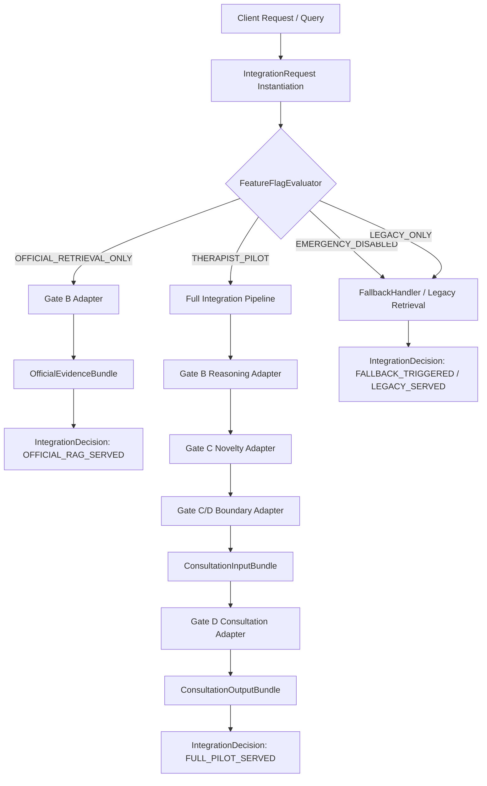
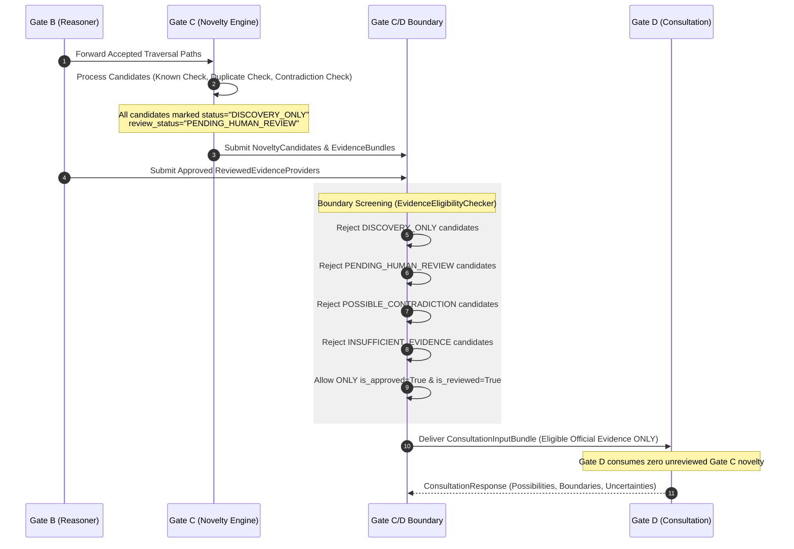
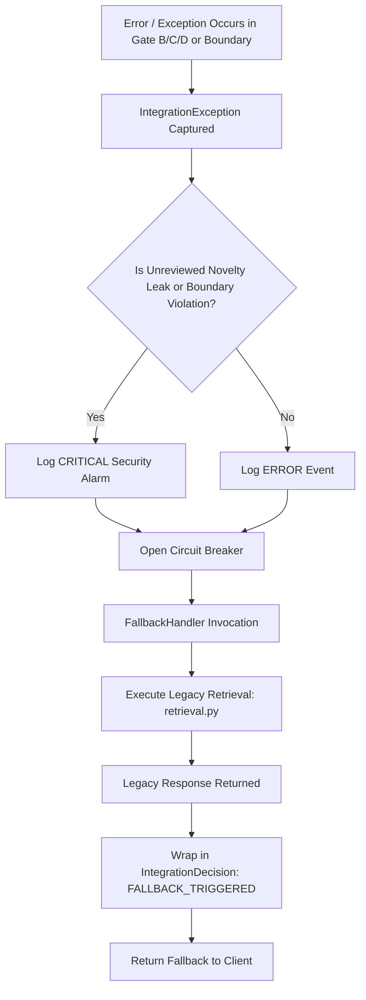
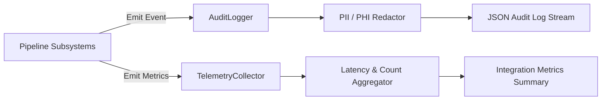

# Controlled Integration Data Flow Specification

## 1. Request Data Flow Architecture

The request data flow governs how incoming user queries are wrapped into an `IntegrationRequest`, evaluated against active feature flags and operating modes, routed through gate adapters, and returned as a structured `IntegrationDecision` and `IntegrationExplanation`.

### Step-by-Step Request Execution Pipeline:
1. **Query Ingestion**: The entry point receives a raw query string, session context, and optional feature flag overrides, creating an immutable `IntegrationRequest`.
2. **Context & Role Validation**: `IntegrationContext` verifies user authorization (`ROLE_INTERNAL_THERAPIST` required for pilot mode).
3. **Mode & Flag Evaluation**: `FeatureFlagEvaluator` checks environment variables and config files to determine the active operating mode.
4. **Execution Dispatch**:
   - `LEGACY_ONLY`: Directly dispatches to `legacy_adapter` (`retrieval.py`).
   - `OFFICIAL_RETRIEVAL_ONLY`: Executes Gate A/B retrieval only via `gate_b_adapter`.
   - `THERAPIST_PILOT`: Executes full multi-gate pipeline via boundary screening.
   - `EMERGENCY_DISABLED` or Exception: Dispatches immediately to `FallbackHandler`.

---

## 2. Evidence Filtering & Boundary Data Flow

This flow illustrates how evidence originates from Gate B, undergoes novelty analysis in Gate C, passes through the deterministic Gate C/D boundary filter, and forms the screened `ConsultationInputBundle` for Gate D.

### Detailed Boundary Rules:
- **Input to Boundary**: Raw Gate B traversal paths and raw Gate C novelty candidates.
- **Evaluation**: `EvidenceEligibilityChecker` evaluates every item without mutating any object.
- **Filtering Verdicts**:
  - `ReviewedEvidenceProvider` (Approved=True, Reviewed=True) -> `ELIGIBLE`.
  - `NoveltyEvidenceFilter` (Status=DISCOVERY_ONLY) -> `BLOCKED` (`BlockedReason.DISCOVERY_ONLY`).
  - `NoveltyEvidenceFilter` (ReviewStatus=PENDING_HUMAN_REVIEW) -> `BLOCKED` (`BlockedReason.PENDING_HUMAN_REVIEW`).
  - `NoveltyEvidenceFilter` (Type=POSSIBLE_CONTRADICTION) -> `BLOCKED` (`BlockedReason.UNRESOLVED_CONTRADICTION`).
- **Output**: `ConsultationInputBundle` containing *only* items with verdict `ELIGIBLE`. `blocked_count` is incremented for all blocked items.

---

## 3. Error & Fallback Data Flow

When a boundary violation, unhandled exception, or invalid flag combination occurs, the error pipeline isolates the failure and executes a fail-closed fallback to legacy retrieval.

### Key Safety Invariants in Error Flow:
1. **Zero Downtime**: The end user always receives a response (either legacy baseline or fallback), even if advanced RAG fails.
2. **Zero Unsafe Output**: An error in Gate C or D never leads to unvalidated output being served; fallback to legacy baseline is instant.
3. **Audit Trail**: Every fallback invocation writes an immutable audit record containing error stack trace, session ID, and timestamp.

---

## 4. Audit & Telemetry Data Flow

All pipeline operations emit non-blocking, structured audit events and performance metrics.

### Log & Telemetry Fields:
- **Audit Logs**: `event_id`, `event_type`, `request_id`, `session_id`, `details` (sanitized query, decision, blocking reasons), `timestamp`.
- **Telemetry Metrics**: `request_latency_ms`, `gate_b_latency_ms`, `gate_c_latency_ms`, `boundary_latency_ms`, `gate_d_latency_ms`, `total_evidence_evaluated`, `eligible_evidence_count`, `blocked_evidence_count`, `fallback_trigger_count`.
