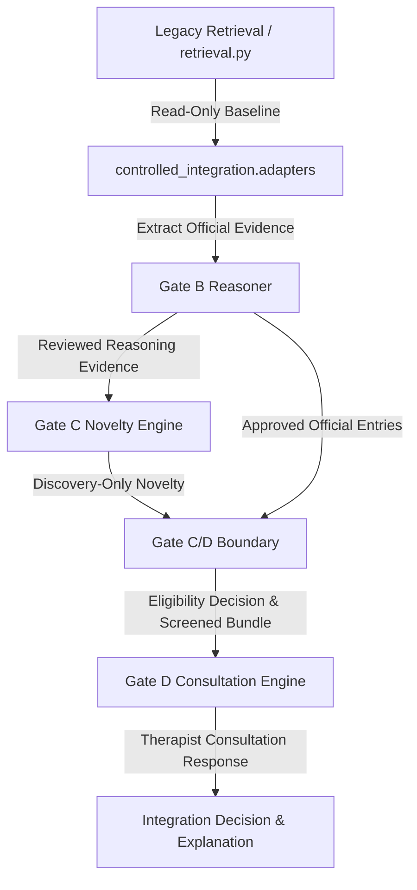
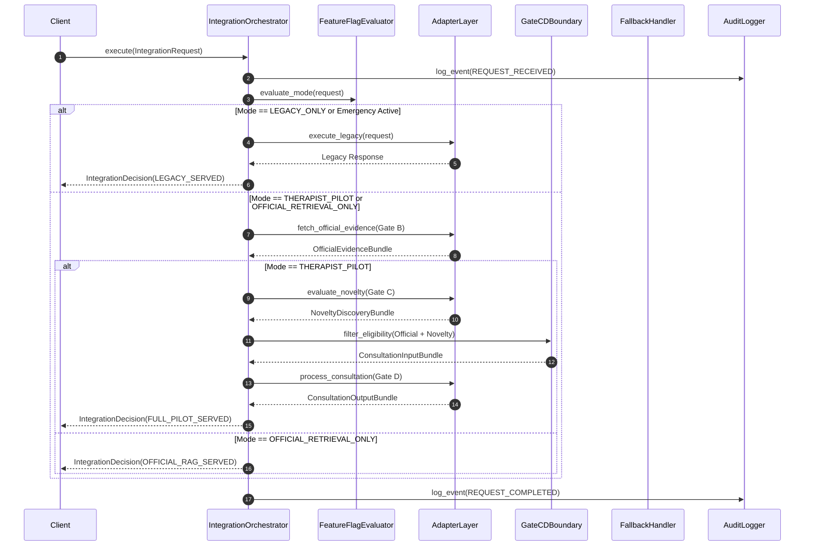

# Controlled Integration Architecture Specification

## 1. Executive Summary & Architecture Overview

The `controlled_integration` package serves as an isolated, zero-side-effect adapter layer connecting closed pipeline Gates (Gate A/B, Gate C, Gate C/D Boundary, Gate D) to legacy production retrieval without altering production retrieval logic (`retrieval.py`).

The primary architectural mandate is **Safety-First Fail-Closed Governance**. By encapsulating inter-gate communication within strict, unidirectional adapters and enforcing boundary contracts, the architecture guarantees that:
1. Legacy production retrieval remains untouched and fully functional as the zero-risk baseline.
2. Unreviewed Gate C novelty candidates can **never** cross into Gate D clinical consultations.
3. Gate C novelty discovery can **never** mutate official knowledge or write inferred relationships to any graph or database.
4. Fail-closed fallback to legacy retrieval occurs instantly upon any boundary, validation, or execution error.

---

## 2. Package Boundaries & Subsystem Definitions

The `controlled_integration` package is structured into seven decoupled, single-responsibility submodules:

```
controlled_integration/
├── adapters/          # Unidirectional interface adapters for Gates A/B, C, C/D Boundary, D, and Legacy
├── orchestration/     # Pipeline orchestrator managing mode evaluation and gate execution
├── feature_flags/     # Feature flag evaluator enforcing control rules and prerequisites
├── fallback/          # Circuit breaker and fail-closed legacy fallback router
├── audit/             # Immutable audit logging engine for compliance and traceability
├── telemetry/         # Performance, latency, evidence counts, and decision metrics recorder
└── exceptions/        # Isolated exception hierarchy for integration errors
```

### Module Responsibilities

| Module | Responsibilities | Dependencies |
| :--- | :--- | :--- |
| `adapters` | Wraps closed gate public interfaces (`models/relation_policy.py`, `models/second_order_reasoner.py`, `gate_c/`, `gate_cd_boundary/`, `gate_d/`). Converts internal gate objects into integration entities. | Subsystem models only |
| `orchestration` | Coordinates sequential gate execution according to active operating mode (`LEGACY_ONLY`, `SHADOW_COMPARE`, `OFFICIAL_RETRIEVAL_ONLY`, `THERAPIST_PILOT`). | `adapters`, `feature_flags`, `fallback`, `audit`, `telemetry` |
| `feature_flags` | Evaluates feature flags, validates prerequisites (`ERR_01` to `ERR_07`), and determines execution path. | `exceptions` |
| `fallback` | Implements circuit breaker and fallback router to execute unmodified legacy retrieval when errors occur. | `audit`, `telemetry`, legacy retrieval |
| `audit` | Generates structured, immutable `IntegrationAuditEvent` logs with PII/PHI redaction. | `models` |
| `telemetry` | Collects execution latency, evidence filtering ratios, and decision counts. | `models` |
| `exceptions` | Defines base `IntegrationException` and sub-exceptions (`BoundaryViolationError`, `UnreviewedNoveltyLeakError`, etc.). | Standard library only |

---

## 3. Core Entities Specification

The integration architecture defines 9 immutable domain entities that mediate data exchange across gate boundaries:

### 3.1. `IntegrationRequest`
The top-level container encapsulating an incoming user query, context, and mode overrides.
- **Fields**: `request_id` (UUID), `query_text` (str), `context` (`IntegrationContext`), `operating_mode_override` (Optional[str]), `flag_overrides` (Dict[str, bool]).
- **Invariant**: Read-only after instantiation.

### 3.2. `IntegrationContext`
Execution metadata including session, user role, and environment.
- **Fields**: `session_id` (str), `user_id` (str), `user_role` (str), `environment` (str), `correlation_id` (str), `timestamp` (str).
- **Invariant**: Must specify valid role (`ROLE_INTERNAL_THERAPIST`, `ROLE_RESEARCHER`, `ROLE_SYSTEM`).

### 3.3. `OfficialEvidenceBundle`
Verified official guidelines and approved glossary terms retrieved via Gate A / Gate B.
- **Fields**: `bundle_id` (str), `official_entries` (List[Dict]), `traversed_paths` (List[Dict]), `confidence_score` (float), `provenance_valid` (bool).
- **Invariant**: Contains ONLY items with `review_state == "APPROVED"` and valid provenance.

### 3.4. `NoveltyDiscoveryBundle`
Discovery-only relation candidates and contradiction records produced by Gate C.
- **Fields**: `bundle_id` (str), `candidates` (List[Dict]), `contradictions` (List[Dict]), `status` (str = `"DISCOVERY_ONLY"`), `review_status` (str = `"PENDING_HUMAN_REVIEW"`).
- **Invariant**: `status` MUST remain `"DISCOVERY_ONLY"`. Never usable by Gate D directly.

### 3.5. `ConsultationInputBundle`
Validated evidence bundle screened by the Gate C/D boundary for consumption by Gate D.
- **Fields**: `session_id` (str), `eligible_official_evidence` (List[Dict]), `blocked_novelty_count` (int), `boundary_decisions` (List[Dict]), `is_validated` (bool).
- **Invariant**: `eligible_official_evidence` contains zero unreviewed or pending Gate C novelty.

### 3.6. `ConsultationOutputBundle`
Structured clinical consultation response produced by Gate D.
- **Fields**: `request_summary` (str), `official_entries` (List[Dict]), `interpretations` (List[Dict]), `alternatives` (List[Dict]), `uncertainties` (List[Dict]), `safety_boundaries` (List[Dict]), `therapist_decision_required` (bool = `True`).
- **Invariant**: Must enforce non-directive clinical advisory language.

### 3.7. `IntegrationDecision`
Top-level execution decision verdict.
- **Fields**: `request_id` (str), `verdict` (Enum: `LEGACY_SERVED`, `OFFICIAL_RAG_SERVED`, `FULL_PILOT_SERVED`, `FALLBACK_TRIGGERED`), `active_mode` (str), `timestamp` (str).

### 3.8. `IntegrationExplanation`
Diagnostic payload explaining the integration decision and gate trace.
- **Fields**: `request_id` (str), `verdict` (str), `step_trace` (List[str]), `blocking_reasons` (List[str]), `score_breakdown` (Dict[str, float]), `boundary_summary` (Dict[str, Any]).

### 3.9. `IntegrationAuditEvent`
Immutable audit log record for compliance and security auditing.
- **Fields**: `event_id` (str), `event_type` (str), `request_id` (str), `session_id` (str), `details` (Dict[str, Any]), `timestamp` (str).

---

## 4. One-Way Dependency Rules & Isolation Contracts

To maintain strict isolation and prevent circular or prohibited dependencies, the architecture enforces a strict DAG (Directed Acyclic Graph) of one-way dependencies:



### Dependency Rules Matrix

1. **Legacy Retrieval Isolation**:
   - Production retrieval (`retrieval.py`) is imported **only** by `controlled_integration/adapters/legacy_adapter.py`.
   - Legacy retrieval code is never modified and has zero knowledge of Gate B, C, or D.

2. **Gate B Reasoning Boundary**:
   - Gate B consumes official graph data and produces `PathDecision` outputs.
   - Only paths with `status == "ACCEPTED"` and `review_state == "APPROVED"` are forwarded.

3. **Gate C Discovery Isolation**:
   - Gate C consumes Gate B paths and evaluates novelty against known knowledge.
   - All Gate C candidates default to `status = "DISCOVERY_ONLY"` and `review_status = "PENDING_HUMAN_REVIEW"`.
   - Gate C **never** writes back to official knowledge databases or graph stores.

4. **Gate C/D Boundary Filter**:
   - The Gate C/D boundary evaluates all evidence passing from Gate C/B toward Gate D.
   - **BLOCKED**: `DISCOVERY_ONLY`, `PENDING_HUMAN_REVIEW`, `REJECTED`, `INSUFFICIENT_EVIDENCE`, `POSSIBLE_CONTRADICTION`, `OUT_OF_SCOPE`.
   - **ALLOWED**: `ReviewedEvidenceProvider` where `is_approved == True` AND `is_reviewed == True`.

5. **Gate D Consultation Boundary**:
   - Gate D receives **only** screened `ConsultationInputBundle` from the boundary adapter.
   - Gate D returns non-directive clinical consultation structures requiring explicit therapist review (`therapist_decision_required = True`).

---

## 5. Safety & Policy Invariants

The integration layer enforces three non-negotiable system safety invariants:

> [!CAUTION]
> **Invariant 1: Gate D Must Never Consume Unreviewed Gate C Novelty**
> Any attempt to pass a Gate C candidate with `status == "DISCOVERY_ONLY"` or `review_status == "PENDING_HUMAN_REVIEW"` directly to Gate D will trigger an immediate `UnreviewedNoveltyLeakError`, halt pipeline execution, raise a security audit alarm, and fall back to legacy retrieval.

> [!IMPORTANT]
> **Invariant 2: Gate C Must Never Modify Official Knowledge**
> Gate C functions purely as a candidate discovery generator. It has zero write permissions to `data/glossary.json`, official graph nodes, or Neo4j databases. No automatic promotion of candidates to official knowledge is permitted.

> [!WARNING]
> **Invariant 3: No Component Writes Inferred Relationships**
> Second-order reasoning (Gate B) and candidate discovery (Gate C) generate transient hypotheses for evaluation only. No component in `controlled_integration` or any Gate writes inferred relationships to persistent storage without explicit, authenticated human reviewer sign-off.

---

## 6. Subsystem Lifecycles

### 6.1. Request Lifecycle



### 6.2. Evidence Lifecycle
1. **Extraction**: Gate A/B adapters retrieve official nodes and traversals.
2. **Provenance Validation**: Each item is checked for valid source ID and provenance string.
3. **Novelty Screening**: Gate C assesses candidate novelty against known knowledge base.
4. **Boundary Eligibility Evaluation**: Gate C/D boundary checker (`EvidenceEligibilityChecker`) applies deterministic rules.
5. **Screened Packaging**: Only eligible items are packaged into `ConsultationInputBundle`. Ineligible items are recorded as `blocked_count` for auditing.

### 6.3. Error Lifecycle
1. **Capture**: All exceptions occurring during gate execution are caught by `IntegrationOrchestrator`.
2. **Classification**: Exceptions are mapped to `IntegrationException` subclasses (`BoundaryViolationError`, `FeatureFlagError`, `GateExecutionError`).
3. **Fail-Closed Trigger**: Circuit breaker opens if error threshold is exceeded or if a critical safety invariant is violated.
4. **Fallback Dispatch**: Control shifts immediately to `FallbackHandler`.

### 6.4. Fallback Lifecycle
1. **Activation**: Triggered by error, invalid feature flag config, or explicit `EMERGENCY_DISABLED` mode.
2. **Execution**: `FallbackHandler` invokes unmodified legacy retrieval (`retrieval.py`).
3. **Response Construction**: Wraps legacy response in `IntegrationDecision` with `verdict = FALLBACK_TRIGGERED`.
4. **Audit Alert**: Logs high-severity `FALLBACK_EXECUTED` audit event with error details.

### 6.5. Audit Lifecycle
1. **Event Generation**: Audit events generated at request start, gate transitions, boundary decisions, errors, and completions.
2. **Context Enrichment**: Attaches session ID, user role, operating mode, correlation ID, and timestamp.
3. **PII/PHI Redaction**: Sanitizes text content to eliminate patient identifiable data.
4. **Immutable Storage**: Writes structured JSON audit events to audit trail logs.
