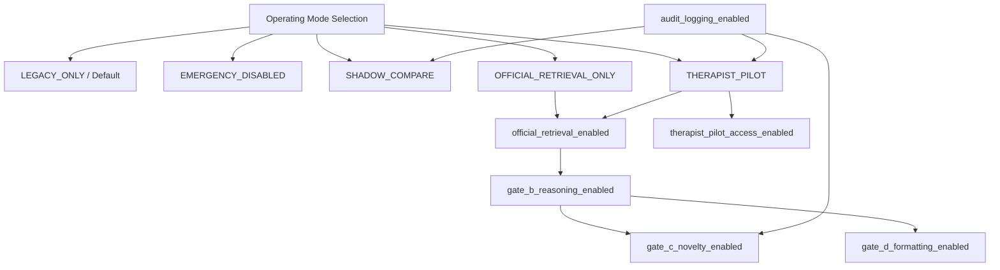

# Feature Flag Contract & Control Architecture

## 1. Executive Summary & Purpose

This document establishes the binding operational contract for feature flag management, mode activation, and safety controls in the Clinical AI GraphRAG Pipeline. 

The primary governance principle of this contract is **Safety First and Fail Closed**. In accordance with clinical safety guidelines and pilot acceptance criteria (`PILOT_ACCEPTANCE_CRITERIA.md`), the system must default to a zero-risk legacy state (`LEGACY_ONLY`) in production, require explicit multi-role governance to activate advanced RAG capabilities, and instantly reject any invalid, unsafe, or unvalidated feature flag configurations.

---

## 2. Operating Modes Specification

The Clinical AI platform operates under five mutually exclusive system-level operating modes. The operating mode governs the top-level execution path of the entire application.

| Operating Mode | Description | Production Default | RAG Pipeline Active | User-Facing Output | Required Prerequisites |
| :--- | :--- | :--- | :--- | :--- | :--- |
| `LEGACY_ONLY` | Pure legacy baseline processing. All RAG, Graph, LLM, and Gate B/C/D logic is completely bypassed. | **YES (Default)** | NO | Legacy Baseline Response | None |
| `SHADOW_COMPARE` | Dual-execution mode. Serves the user with legacy response while running GraphRAG asynchronously to compare metrics, latency, and response diffs in audit logs. | NO | YES (Shadow) | Legacy Baseline Response | `audit_logging_enabled == true`, Staging/Pilot env approval |
| `OFFICIAL_RETRIEVAL_ONLY` | Restricted RAG retrieval mode. Executes deterministic Graph/Glossary lookups (Gate A/B retrieval) but suppresses generative synthesis, Gate C novelty claims, and Gate D autonomous formatting. | NO | YES (Retrieval only) | Verified Glossary & Document Excerpts | `official_retrieval_enabled == true`, Gate A/B Audit Sign-off |
| `THERAPIST_PILOT` | Full internal pilot mode for verified internal clinical staff. Enables complete GraphRAG pipeline including reasoning, novelty, and structured consultation templates. | NO | YES (Full) | GraphRAG Clinical Consultation Output | `INTERNAL_CLINICAL_PILOT_READY == true`, All Gate A-D Audits Signed Off, RBAC Enforcement |
| `EMERGENCY_DISABLED` | Master kill-switch mode. Overrides all feature flags to `false`. Instantly freezes all AI components and returns deterministic static fallbacks. | NO | NO (Frozen) | Static Emergency Fallback Response | Triggered by automated safety alarms or manual emergency override |

> [!IMPORTANT]
> **Production Default Rule**: In production (`ENVIRONMENT=PROD`), the active operating mode MUST default to `LEGACY_ONLY` unless explicitly overridden by an authenticated deployment configuration signed off by the Clinical Safety Officer and Lead Architect.

---

## 3. Granular Feature Flag Catalog

The system defines 7 independent, fine-grained feature flags that control specific functional components.

| Flag Key | Description | Owner Role | Prod Default | Staging Default | Dev Default | Prerequisites |
| :--- | :--- | :--- | :--- | :--- | :--- | :--- |
| `official_retrieval_enabled` | Controls lookup in `data/glossary.json` and official methodology document graph nodes. | Lead Data Architect | `false` | `true` | `true` | Gate A Audit Signed Off |
| `gate_b_reasoning_enabled` | Controls multi-hop graph traversal, entity linking (`fuzzy_threshold=86`), and relationship depth (`reasoning_depth_default=2`). | AI Reasoning Engineer | `false` | `false` | `true` | `official_retrieval_enabled == true` |
| `gate_c_novelty_enabled` | Controls Gate C novelty discovery and cross-domain therapeutic hypothesis generation. | Clinical Safety Officer | `false` | `false` | `true` | `gate_b_reasoning_enabled == true`, `audit_logging_enabled == true` |
| `gate_d_formatting_enabled` | Controls Gate D consultation response structuring, recommendation templates, and advisory output formatting. | Clinical UX & Safety Board | `false` | `false` | `true` | `gate_b_reasoning_enabled == true` |
| `audit_logging_enabled` | Controls immutable logging of prompt inputs, retrieved nodes, confidence metrics, and execution traces. | Chief Security Officer | `true` | `true` | `true` | None (Must remain `true` across all envs) |
| `shadow_comparison_enabled` | Controls parallel shadow execution and diff recording between legacy and GraphRAG pipelines. | MLOps Lead | `false` | `true` | `false` | `operating_mode == "SHADOW_COMPARE"`, `audit_logging_enabled == true` |
| `therapist_pilot_access_enabled` | Master gate for enabling therapist pilot user access via RBAC (`ROLE_INTERNAL_THERAPIST`). | Clinical Director | `false` | `false` | `false` | `operating_mode == "THERAPIST_PILOT"`, `INTERNAL_CLINICAL_PILOT_READY == true` |

---

## 4. Flag Ownership, Roles, and Sign-off Matrix

Feature flags cannot be modified unilaterally. Any change to flag states in Staging or Production requires multi-role sign-off as defined below:

| Flag / Mode Change | Responsible Owner | Mandatory Approval Roles | Verification Artifact Required |
| :--- | :--- | :--- | :--- |
| Operating Mode -> `SHADOW_COMPARE` | MLOps Lead | Lead Architect, DevOps Lead | Shadow benchmarking test plan |
| Operating Mode -> `OFFICIAL_RETRIEVAL_ONLY` | Lead Data Architect | Clinical Safety Officer | Gate A & B Audit Sign-off (`docs/gate_b_audit/`) |
| Operating Mode -> `THERAPIST_PILOT` | Clinical Director | Clinical Safety Officer, Lead Architect, Security Lead | `PILOT_ACCEPTANCE_CRITERIA.md` checklist sign-off |
| Enable `gate_c_novelty_enabled` | Clinical Safety Officer | Clinical Review Board | Gate C Novelty Safety Audit (`docs/gate_c_design/`) |
| Enable `gate_d_formatting_enabled` | Clinical UX Lead | Clinical Safety Officer | Gate D Formatting & Advisory Sign-off (`docs/gate_d_design/`) |
| Disable `audit_logging_enabled` | Security Lead | **REJECTED IN PROD/STAGING** | Security Exception Waiver (DEV only) |
| Mode -> `EMERGENCY_DISABLED` | Any On-Call / CSO / System | **Unilateral / Instant** | Incident Ticket (post-execution) |

---

## 5. Dependency Hierarchy & Prerequisites Graph

The feature flag evaluation engine enforces strict dependency rules. A child flag cannot be evaluated to `true` unless all parent prerequisites are satisfied.

---

## 6. Validation Rules & Invalid Combination Rejection

The flag validator component (`FeatureFlagValidator`) executes upon application startup and configuration refresh. If an invalid flag combination is detected, the validator **REJECTS** the configuration, raises `InvalidFlagCombinationError`, logs a high-severity security alert, and forces the application to `LEGACY_ONLY` or `EMERGENCY_DISABLED`.

### Rejection Rules Table:

1. **Rule ERR_01 (Emergency Override)**:
   If `operating_mode == "EMERGENCY_DISABLED"`, all sub-flags (`official_retrieval_enabled`, `gate_b_reasoning_enabled`, `gate_c_novelty_enabled`, `gate_d_formatting_enabled`, `shadow_comparison_enabled`, `therapist_pilot_access_enabled`) MUST be `false`.
   *Action if violated*: Force all sub-flags to `false`.

2. **Rule ERR_02 (Legacy Mode Isolation)**:
   If `operating_mode == "LEGACY_ONLY"`, flags `gate_b_reasoning_enabled`, `gate_c_novelty_enabled`, `gate_d_formatting_enabled`, and `therapist_pilot_access_enabled` MUST be `false`.
   *Action if violated*: Config rejection (`InvalidFlagCombinationError`). Fallback to default `LEGACY_ONLY`.

3. **Rule ERR_03 (Gate B Missing Prerequisite)**:
   `gate_b_reasoning_enabled == true` REQUIRES `official_retrieval_enabled == true`.
   *Action if violated*: Disable Gate B reasoning (`gate_b_reasoning_enabled = false`).

4. **Rule ERR_04 (Gate C Missing Prerequisites)**:
   `gate_c_novelty_enabled == true` REQUIRES `gate_b_reasoning_enabled == true` AND `audit_logging_enabled == true`.
   *Action if violated*: Disable Gate C novelty discovery (`gate_c_novelty_enabled = false`).

5. **Rule ERR_05 (Gate D Missing Prerequisite)**:
   `gate_d_formatting_enabled == true` REQUIRES `gate_b_reasoning_enabled == true`.
   *Action if violated*: Disable Gate D consultation formatting (`gate_d_formatting_enabled = false`).

6. **Rule ERR_06 (Therapist Pilot Without Audit Logging)**:
   `therapist_pilot_access_enabled == true` REQUIRES `operating_mode == "THERAPIST_PILOT"` AND `audit_logging_enabled == true`.
   *Action if violated*: Config rejection. Revoke pilot access.

7. **Rule ERR_07 (Unknown Flag Key)**:
   Any flag key present in config that is not defined in `FEATURE_FLAG_SCHEMA.json` is treated as an unknown key hazard.
   *Action if violated*: Immediate **Fail Closed** to `LEGACY_ONLY`.

---

## 7. Runtime Configuration Loading & Precedence

Feature flag state is evaluated at runtime using the following strict precedence hierarchy (highest to lowest priority):

1. **Emergency Overrides**: `CLINICAL_AI_EMERGENCY_DISABLE=true` environment variable or active shutdown trigger file.
2. **Environment Variables**: `CLINICAL_AI_OPERATING_MODE`, `CLINICAL_AI_FEATURE_FLAG_*`.
3. **Configuration File**: `config/feature_flags.json` (validated against `FEATURE_FLAG_SCHEMA.json`).
4. **Hardcoded Safety Defaults**: `operating_mode = LEGACY_ONLY`, all sub-flags `false` except `audit_logging_enabled = true`.

---

## 8. Alignment with Pilot Readiness (`PILOT_ACCEPTANCE_CRITERIA.md`)

This contract directly satisfies Requirement 9 ("Master Feature Flag"), Requirement 10 ("Legacy Fallback"), Requirement 11 ("Rollback"), and Requirement 12 ("Audit Trail") of `PILOT_ACCEPTANCE_CRITERIA.md`. The therapist pilot cannot be enabled in any environment unless the condition `INTERNAL_CLINICAL_PILOT_READY` is set to `true` by the formal Clinical Review Board sign-off.
