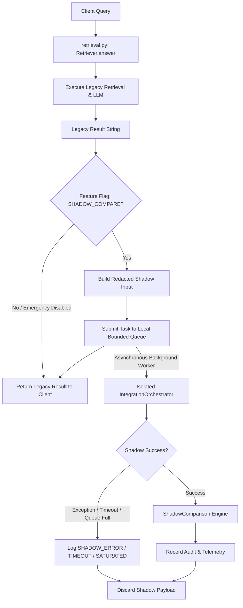

# Shadow Data Flow Architecture

## Privacy & Redaction Boundaries

1. **Input Sanitization**: User IDs are hashed with salted SHA-256 (`sha256:{hash}`). Query text is sanitized via `SecurityPolicy.scan_pii()` with specific regex patterns for Israeli PII (ID numbers, 05x/0x/972 phones, HMO IDs, case files).
2. **Execution Strategy**: `OFF_CRITICAL_PATH_SHADOW`. Legacy result is returned immediately without waiting for background shadow comparison.
3. **Queue Saturation**: Under heavy load, tasks are dropped cleanly (`DROP_SHADOW_TASK_AND_AUDIT`) without queuing delays or retries on the request thread.
